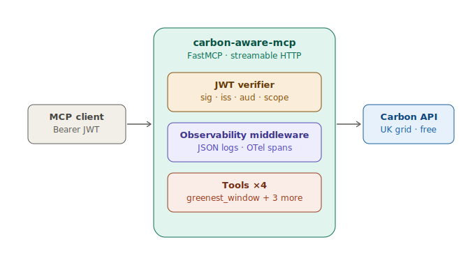

# carbon-aware-mcp
v0.1.1

A remote [MCP](https://modelcontextprotocol.io) server exposing live UK grid
carbon-intensity tools, so an LLM agent can schedule workloads when the grid is cleanest.

🔗 **Live:** https://carbon-aware-mcp.salmonmeadow-0b5a3a9d.polandcentral.azurecontainerapps.io

## What it does
Given a job of length D, an agent can ask when in the next N hours the UK grid will be
cleanest to run it. The main tool, `greenest_window`, returns the lowest-carbon
contiguous window; three helper tools wrap the UK Carbon Intensity API for live data.

## Tools
| Tool | Purpose |
|------|---------|
| `greenest_window` | Lowest-carbon contiguous window for a job of duration D (whole hours), starting within N hours (default 48) |
| `current_intensity` | Latest national gCO2/kWh + index band |
| `forecast` | Half-hourly forecast, next N hours (1–48; clamped to 48) |
| `generation_mix` | Current generation mix by fuel type |

**Limits (verified, not assumed — see Decision log):** the upstream UK Carbon Intensity
API forecasts 48h ahead at 30-minute resolution. `forecast` clamps any request to 48h.
`greenest_window` searches within `within_hours` (default 48, matching the horizon) and
raises `ValueError` only when `duration_hours` exceeds the 48h forecast — i.e. when the job
is genuinely longer than the available data.

## Architecture


MCP client → JWT verification → FastMCP server (+ observability middleware) → UK Carbon Intensity API.

- **Transport:** streamable HTTP — remote, deployable, stateless mode for serverless.
- **Auth:** asymmetric JWT — server holds only the public key; verifies signature, issuer, audience, scope.
- **Observability:** structured JSON logs + OpenTelemetry spans via middleware (logs arg keys, never values).

## Running it
```bash
uv sync
uv run python scripts/gen_keys.py          # generate keypair + token
# put the public key in .env, export the token
uv run carbon-mcp                           # local server
uv run python scripts/smoke.py              # local smoke test
MCP_URL=<cloud-url>/mcp uv run python scripts/smoke.py   # against the deployed server
uv run python scripts/probe_api_limits.py   # characterize upstream limits (manual, not CI)
```

## Decision log
- **Streamable HTTP over stdio** — a remote, deployable transport. stdio is one local
  process per client; HTTP makes it a shared, network-reachable service (which is why it
  needs auth).
- **Asymmetric JWT over a shared secret** — the server holds only the public key, so it
  can verify tokens but never mint them; even a fully compromised server can't forge
  credentials. A shared secret (HS256) can't separate those — anything that verifies can
  also sign.
- **FastMCP over the raw MCP SDK** — generates the tool schema from type hints and
  docstrings by introspection, so I write Python functions instead of maintaining protocol
  boilerplate. Less surface for errors.
- **Middleware-based observability** — one place wraps every tool call, so logging can't
  be forgotten per-tool. It records argument keys, not values: enough to debug the call
  shape without logging potentially sensitive inputs.
- **Azure Container Apps, scale-to-zero** — serverless, scales to zero (capped at max 1
  for this POC) so idle cost is $0. The same container runs anywhere; chose Container Apps
  for managed HTTPS, ingress, and source-to-deploy.
- **API limits read from source, then verified against the live upstream** — the forecast
  horizon (48h, 30-min resolution) is a hard clamp in `carbon_client.forecast`
  (`min(hours, 48)`, upstream `fw48h` endpoint), and `greenest_window` takes whole
  `duration_hours`, raising when the job exceeds its `within_hours` search window.
  `scripts/probe_api_limits.py` confirms the upstream matches these assumptions rather than
  discovering unknowns — run by hand, not in CI (it hits the live API and has no pass/fail).
  *Verified 2026-06-24:* slot counts matched expectations at every horizon (72h/96h both
  clamp to 96 slots = 48h); `greenest_window` raised exactly at `duration_hours > within_hours`.
  The probe surfaced that the default `within_hours` (originally 24) didn't match the 48h data
  horizon — a 30h job raised even though the data existed. Fixed by defaulting `within_hours`
  to 48 so the tool answers whenever the forecast supports it; the `ValueError` is now reserved
  for jobs that genuinely exceed the 48h horizon. Eval `limits-*` rubrics encode these
  confirmed boundaries.

## Scaling notes
Not built in v0.1 — what production would need:

- **Cache the forecast (short TTL).** Every tool call currently hits the UK Carbon API
  live, which is the first bottleneck under load. The data only changes every 30 minutes,
  so a ~5-minute cache cuts upstream calls dramatically for free.
- **Per-client rate limiting** — throttle requests per token so one client can't exhaust
  the server or the upstream API budget.
- **Metrics + alerting.** The OTel spans already capture per-tool latency and
  success/failure, so the instrumentation is there; production would add a metrics backend
  (Azure Monitor / Grafana) and alerts on p95 latency and error rate.
