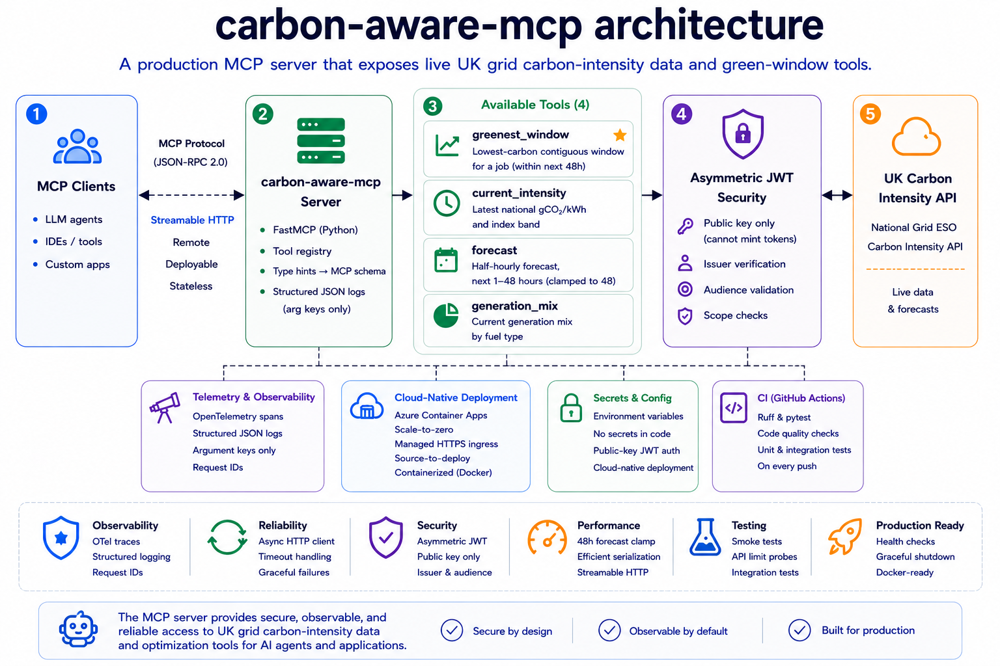

# carbon-aware-mcp

v0.1.1

A production MCP server exposing live UK grid carbon-intensity data and green-window optimization tools.

The server provides four tools over streamable HTTP, authenticates clients with asymmetric JWTs, and runs as a scale-to-zero service on Azure Container Apps.

🔗 **Live:** https://carbon-aware-mcp.salmonmeadow-0b5a3a9d.polandcentral.azurecontainerapps.io

This repository is the tools layer of a three-repo system —
[carbon-aware-agent](https://github.com/michalskimm/carbon-aware-agent) (orchestration),
[carbon-aware-eval](https://github.com/michalskimm/carbon-aware-eval) (evaluation),
and this server (tools) — built end to end to demonstrate an agentic system: the tools an
agent calls, the agent that calls them, and the eval that holds it to a standard.

## Architecture



MCP client → (streamable HTTP + JWT) → FastMCP server → UK Carbon Intensity API.

The server exposes four tools over a remote, stateless transport, verifies clients with
asymmetric JWTs, emits OpenTelemetry spans and structured logs, and runs as a
scale-to-zero container on Azure Container Apps.

## Overview

Given a job of length **D**, an agent can ask when in the next **N** hours the UK grid
will be cleanest to run it. The primary tool, `greenest_window`, returns the
lowest-carbon contiguous window; three helper tools expose live UK Carbon Intensity API data.

Available tools:

| Tool                | Purpose                                                                                                     |
| ------------------- | ----------------------------------------------------------------------------------------------------------- |
| `greenest_window`   | Lowest-carbon contiguous window for a job of duration D (whole hours), starting within N hours (default 48) |
| `current_intensity` | Latest national gCO₂/kWh and index band                                                                     |
| `forecast`          | Half-hourly forecast, next N hours (1–48; clamped to 48)                                                    |
| `generation_mix`    | Current generation mix by fuel type                                                                         |

The upstream UK Carbon Intensity API provides forecasts **48 hours ahead at
30-minute resolution**. That boundary is enforced explicitly rather than assumed:

* `forecast` clamps requests to 48 hours.
* `greenest_window` defaults `within_hours` to 48, matching the data horizon.
* A `ValueError` is raised only when a job genuinely exceeds the available forecast.

The limits are verified against the live upstream API rather than inferred from
documentation alone (see **Key design decisions**).

## How it works

* **Streamable HTTP transport** — remote, deployable, and stateless. Unlike stdio,
  multiple clients can share a single authenticated service.
* **FastMCP generates the protocol layer** — tool schemas come from Python type
  hints and docstrings rather than hand-written protocol definitions.
* **Asymmetric JWT authentication** — the server holds only the public key, so it
  can verify credentials but can never mint them.
* **Structured observability by default** — middleware emits OpenTelemetry spans
  and structured JSON logs while recording argument keys rather than values.
* **Async throughout** — the request path is I/O-bound (HTTP to the upstream API),
  so the implementation uses async end to end.
* **Cloud-native deployment** — the same container runs locally or on Azure
  Container Apps, with managed HTTPS ingress and scale-to-zero semantics.
* **Continuous integration** — Ruff and pytest run on every push to catch quality,
  formatting, and import-time issues early.

## Running it

Copy `.env.example` to `.env`, generate a keypair, place the public key in the
environment, and export a valid JWT token for local testing.

```bash
uv sync

uv run python scripts/gen_keys.py          # generate keypair + token
# put the public key in .env, export the token

uv run carbon-mcp                          # local server

uv run python scripts/smoke.py             # local smoke test
MCP_URL=<cloud-url>/mcp \
    uv run python scripts/smoke.py         # deployed server

uv run python scripts/probe_api_limits.py  # characterize upstream limits
```

The local quality gate:

```bash
uv run ruff check . \
&& uv run ruff format --check . \
&& uv run pytest -q \
&& echo "GATE GREEN"
```

## Key design decisions

* **Streamable HTTP over stdio** — a remote, deployable transport. Stdio creates
  one local process per client; HTTP makes the server a shared, network-reachable
  service and therefore requires authentication.

* **Asymmetric JWT over a shared secret** — the server holds only the public key,
  so it can verify tokens but never mint them. Even a fully compromised server
  cannot forge credentials. HS256 cannot provide that separation of duties.

* **FastMCP over the raw MCP SDK** — schemas are generated automatically from type
  hints and docstrings, reducing protocol boilerplate and keeping the surface area
  for errors small.

* **Middleware-based observability** — one wrapper captures every tool call, so
  logging cannot be forgotten per tool. Argument keys are recorded, but never
  values, preserving debugging context without exposing potentially sensitive data.

* **Azure Container Apps, scale-to-zero** — the POC runs at a maximum of one
  replica, so idle cost is effectively zero. The same container runs anywhere;
  Container Apps provides managed HTTPS ingress and source-to-deploy workflows.

* **API limits verified against the live upstream** — the forecast horizon
  (48 hours at 30-minute resolution) is enforced in code and confirmed via
  `scripts/probe_api_limits.py`. The probe is intentionally manual rather than CI,
  since it exercises a live external dependency and has no pass/fail semantics.

  *Verified 2026-06-24:* 72h and 96h requests both clamp to 96 slots (48 hours),
  and `greenest_window` raises precisely when a job exceeds its search horizon.
  The probe also surfaced that the original default `within_hours=24` prevented
  valid 30-hour jobs despite sufficient forecast data. The default was changed to
  48 so the tool fails only when the upstream data genuinely ends.

## Known limitations

Stated deliberately — this is a production-style demo, not a complete carbon platform.

* **UK-only scope** — the server wraps the UK Carbon Intensity API and does not
  currently support other grids or regions.

* **No forecast caching** — every request hits the upstream API live. The data
  changes every 30 minutes, so a short cache would dramatically reduce load.

* **Single-replica deployment** — the Container Apps deployment is intentionally
  capped at one replica for the POC and does not exercise horizontal scaling.

* **JWT authentication only** — sufficient for trusted clients, but a broader
  platform would likely integrate with a full identity provider and client
  management layer.

## Future work

This repository provides the **tools layer** of the system. Not built in v0.1 —
what production would add:

* **Forecast caching (short TTL)** — the first scaling bottleneck is unnecessary
  upstream traffic. A ~5-minute cache would dramatically reduce request volume.

* **Per-client rate limiting** — to prevent a single consumer from exhausting
  server or upstream capacity.

* **Metrics and alerting** — the OpenTelemetry instrumentation already exists;
  production would add Azure Monitor, Grafana, or equivalent dashboards and
  alerts on p95 latency and error rates.

* **Multi-region support** — the same architecture could expose carbon-intensity
  tools for additional grids and allow agents to optimize across regions.

* **Richer optimization tools** — cost-aware, carbon-aware, and hybrid scheduling
  decisions built on top of the existing forecast primitives.
